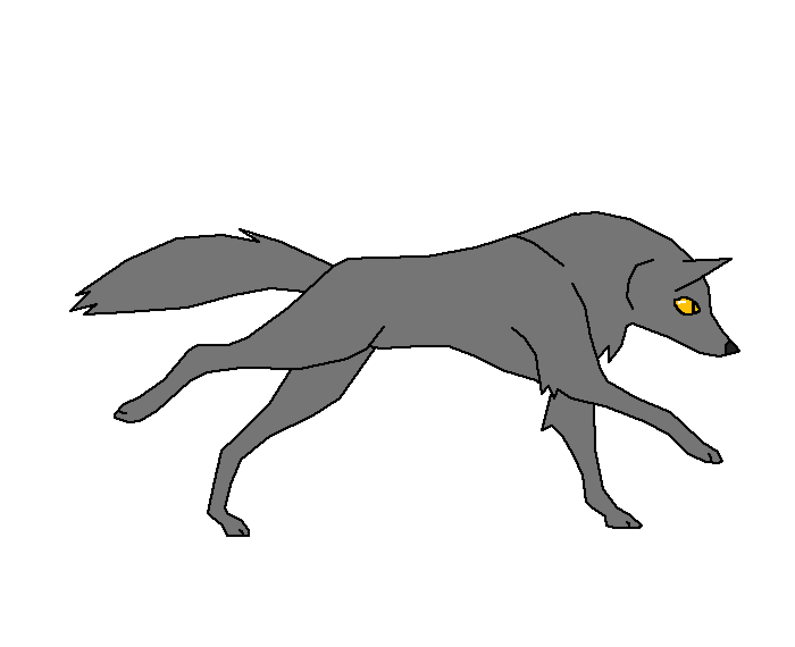

#  Hey, I'm Xuan 

  
  <!--  -->
  
  <!-- 
  
   -->
  
    

## 🔗 Links

## 🚀 About Me

I majored in software engineering at Thuy Loi university, I have 1.5 years experience working with C# and javascript.

<!-- <ul>
<li/>I like to use my skills to support my team by automating existing manual processes or introducing new ones.</li>
<li/>I enjoy constantly improving my knowledge base by exploring new tools or collaborating with other developers.</li>
<li/>I am a curiosity driven individual and a fast learner.</li>
<li/>Applying my engineering skills to solve real life problems excites me.</li>
</ul> -->

## 🛠️ Skills

### Languages

### Front-End Development

### Back-End Development

### Desktop App Development

### Database

